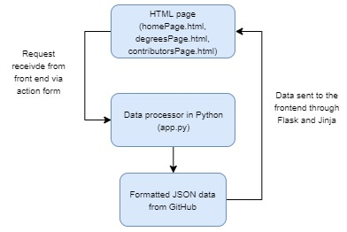
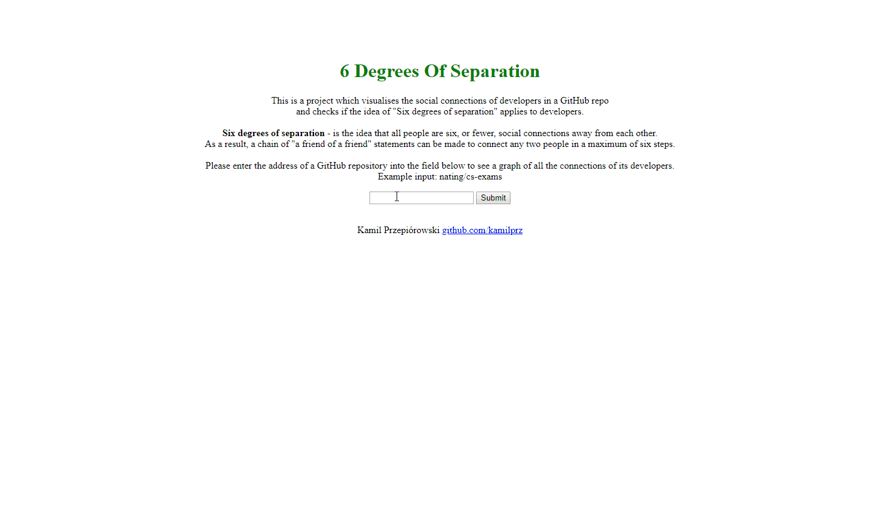
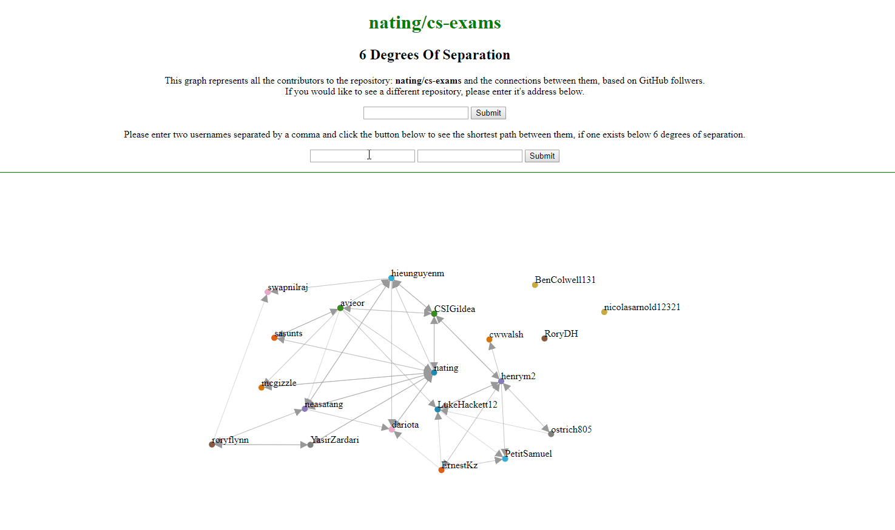

# GitHub-API

# GitHub Access
## Task
Interrogate the GitHub API to retrieve and display data regarding the logged in developer.

## Description
The assignment demonstrates the use of the PyGithub library for Python to retrieve and display data from GitHub. It builds a basis for the Visualising GitHub project.

This basic implementation pulls all of the repos from my account and prints out their name and latest commit id in the console.

Found in file 'testing.py', the commit which identifies this assignment is 1f61fd361a4536cf17b7698fd8d4260f5140d475.

 

# Visualising GitHub
## Task
Interrogate the GitHub API to build visualisation of data available that elucidates some aspect of the softare engineering process, such as a social graph of developers and projects, or a visualisation of indiviudal of team performance. Provide a visualisation of this using the d3js library.

## Description
For this project I decided to do something regarding social connections between people. I previously heard about the 6 degrees of separation idea and decided to test if it's true between developers on GitHub.

**Six degrees of separation** - is the idea that all people are six, or fewer, social connections away from each other. Often called as 6 Handshakes rule. As a result, a chain of "a friend of a friend" statements can be made to connect any two people in a maximum of six steps.

I wanted to test if this idea holds true for all developers who have contributed to the same repository. Users can enter two usernames of developers and get back a graph of the shortest path between them - if one exists and is shorter than 6 connections (edges) away.

## Design
The project is developed in Python3 and the PyGithub library. It runs on localhost:5000 through the use of Flask. The following command is used to boot it up: <code>python3 -m flask run</code>  

The project uses locally stored JSON files rather than a database to store the fetched data from GitHub. There is pre-processing done on the data to format it into the desired shape, and then the JSON files are passed to the relevant HTML files which display the graphs through the d3 library. The connection between Python and HTML/JS is handled by Flask in the 'app.py' file. The overall application design follows this structure:

The landing page localhost:5000 has a description of the project and the expected user input. The user can enter the address of a repository and click submit - this will display a force directed graph of all the contributors to the repository and the connections between them based on GitHub followers.

The user can then enter an address of a repository - this will redirect them to localhost:5000/repo where a force directed graph will be displayed. (for the purposes of demonstration the gif has been sped up to show off the functionality, in practise the loading time is longer as all the data needs to be fetched from GitHub first)

From here, the user can either enter a new repository to view, or two usernames of contributors to the currently displayed repo. This will display a graph of the shortest path between the two users if one exists and is within the "Six degrees of separation". The path can consist of any users which are connected to the source and target - the only requirements are that the source and target are both contributors to the current repository, and the path is consistently directed. (again, for the purposes of demonstration the gif has been sped up for the same reasons as previously)

